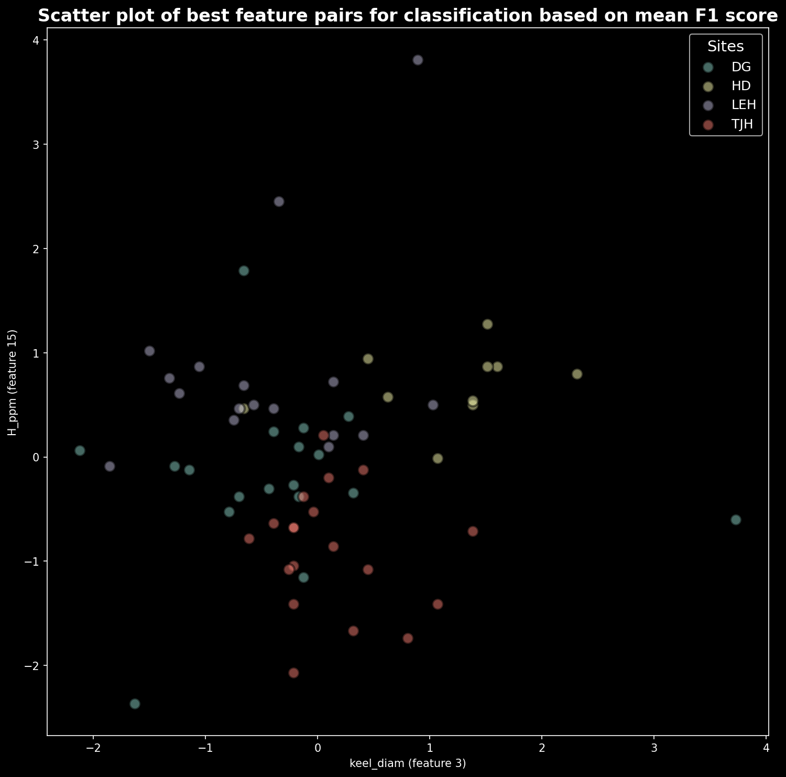
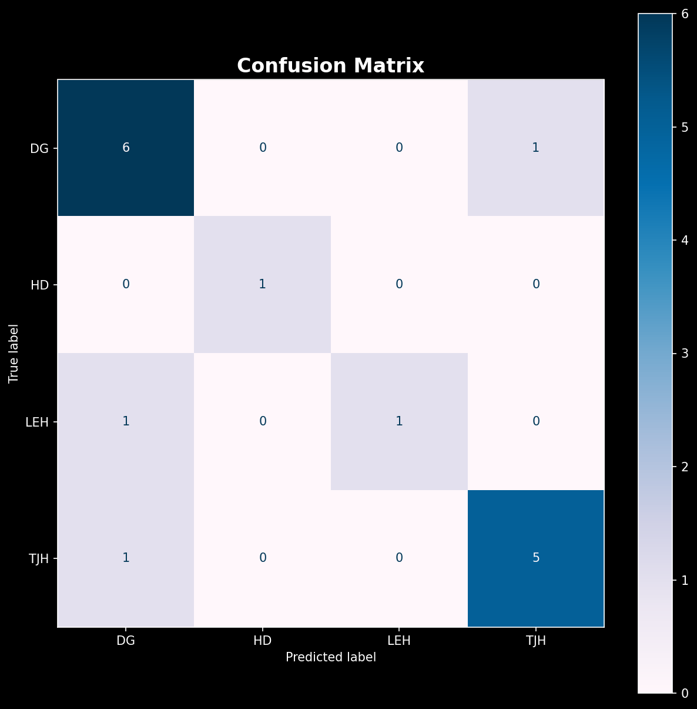
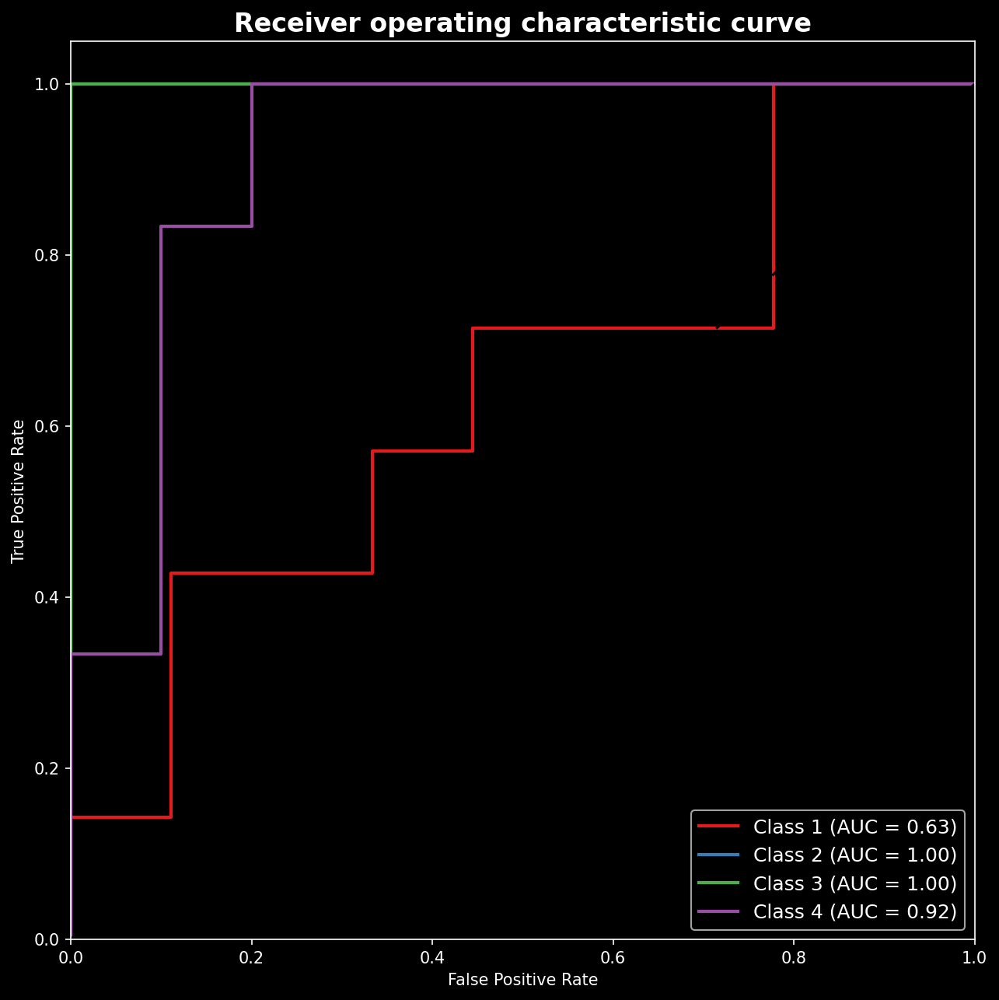
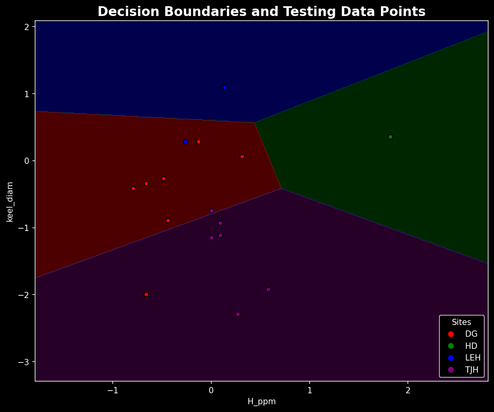

# Plant Classification Using Stochastic Gradient Descent (SGD)

## Problem Statement
Classifying plant species based on measurable features is a supervised machine learning problem.  
The objective of this project is to build a classification model that can accurately predict plant classes using numerical feature inputs.

This project implements a Stochastic Gradient Descent (SGD) classifier, a scalable and efficient linear model particularly suitable for large datasets and high-dimensional data.

The goal is to:
- Preprocess the dataset
- Train an SGD-based classifier
- Evaluate model performance
- Analyze classification accuracy and model behavior

## Dataset
The project uses:
- Plants_Dataset.csv

### Dataset Characteristics
- Tabular dataset
- Multiple numerical feature columns
- Target variable representing plant class labels

### Features
The dataset contains:
- Quantitative plant measurements (feature variables)
- A categorical target column representing plant type

### Target
- Plant species classification label

## Approach

### 1. Data Preprocessing
- Load dataset using Pandas
- Handle missing values 
- Separate features (X) and target (y)
- Train-test split
- Feature scaling (Standardization recommended for SGD)

### 2. Model Selection
The model used SGD

- Efficient for large-scale learning
- Works well for linear classification problems
- Supports different loss functions (hinge, log-loss, etc.)
- Performs incremental learning

### 3. Training
The model was trained using:
- Specified learning rate
- Regularization
- Iterative optimization using stochastic updates

### 4. Evaluation
Model performance was evaluated using:
- Accuracy score
- Confusion matrix
- Classification report (Precision, Recall, F1-score)

## Results
- The SGD classifier successfully learned decision boundaries for plant classification.
- Feature scaling significantly improved model convergence.
- Model performance demonstrates the effectiveness of linear classifiers for structured tabular data.

### Feature Distribution (scatter plot)


### Confusion matrix


### ROC curve


### Visualization of decision boundaries 


## Tech Stack
- Python  
- Pandas  
- NumPy  
- Scikit-learn  
- Matplotlib / Seaborn 
- Jupyter Notebook  

## How to Run: Using Conda

### 1. Install dependencies:
```bash
conda env create -f environment.yml
conda activate mlplants
```

### 2. Ensure that Plants_Dataset.csv is present is in the current working directory

### 3. Run the notebook
Open:Stochastic Gradient Descent woirkflow to classify the plants data.ipynb

## Future Improvements 
- Perform hyperparameter tuning (GridSearchCV / RandomizedSearchCV)
- Compare against other models (Logistic Regression, Random Forest, SVM)
- Add cross-validation
- Add feature importance analysis
